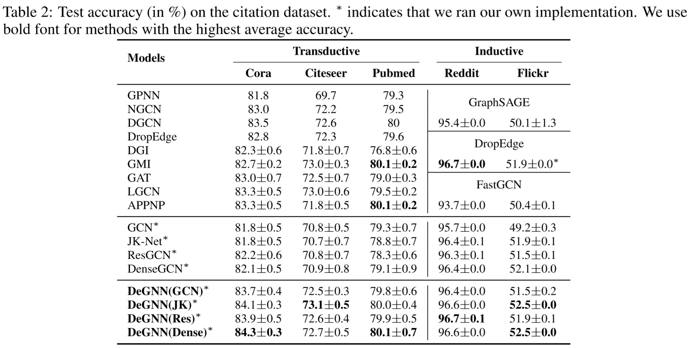

# DeGNN: Characterizing and Improving Graph Neural Networks with Graph Decomposition.

This repository is the official implementation of DeGNN. 

## Requirements

To install requirements:

```setup
pip install -r requirements.txt
install metis-5.1.0
```
To install metis-5.1.0:
- download the [metis-5.1.0](http://glaros.dtc.umn.edu/gkhome/fetch/sw/metis/metis-5.1.0.tar.gz)
- cd metis-5.1.0
- make config
- make


## Training

To train the model(s) in the paper:


>run the ipynb notebook file	：“Generate_graph_file_4_Metis”

>> - input: the adjacent matrix of graph dataset (e.g. cora)
>>- output:  the file "cora.graph" for metis

>   run the metis programs:
```train
 ./gpmetis cora.graph 40
```
>>- input: the file "cora.graph"
>>- output:  the metis file "cora.graph.part.40"

>run the ipynb notebook file "DeGNN_Dense.ipynb"

>> - input: the file "cora.graph.part.100" and the graph file in dir "data"
>>- output:  the test accuracy

## Results

We test DeGNN on inductive and transductive settings:


